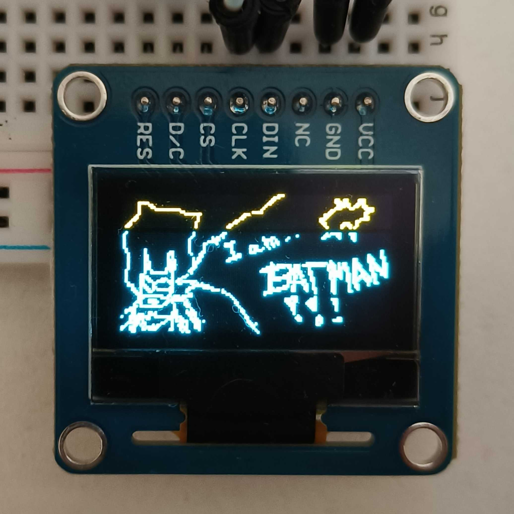

# Notes

- This projects implements 4-wire [SPI](https://cs.wikipedia.org/wiki/Serial_Peripheral_Interface)-based communication protocol with 0.96 inch OLED display. Protocol is modified version of SPI in the sense that there is no MISO, because why would you need something back from the screen. Instead though, you use D/C wire which serves to toggle **Data**/**Command** mode. This tells the display how to interpret incoming bytes. From the MCU perespective, transfer itself is just plain SPI (we put a byte into `SPI1 DR` register for the send-off).

## Display

- The display is OLED with resolution of 128x64, where top 128x16 banner is yellow monochrome, and rest is blue monochrome. This makes it ideal for stuff like info UI and stuff, but I dont really care. There are, however, some importnat things to know, and they are described below.

### 1. D/C pin and configuring

- Initialy, I thought you simply blast data via SPI with some format which the display will handle and show. In reality, you have to do initialization of the display, where you configure things such as addressing mode, ACTUAL resolution (I am assuming this is because the driver / actual hw driving the display is generic, so you need to tell it) of the screen, contrast and others... These can be seen being configured in `OLED_init`. This is done by just sending bytes to the display, BUT with the `D/C` wire being pulled down. This routes the byte to the display configuration, instead of displaying it as data. Notable configuration setting is the *charge pump* setting, which I had to enable, as it seems that "pixels need higher voltage to excite organic material and emit light" to start the display (Suggested by Gemini, I am not an electrical engineer, seems logical though). After configuring it, it worked fine.

### 2. Display indexing

- The display internally tracks which pixel to write next, and based on the configuration you gave it, it will behave differently. The way I have it set up here makes it draw the screen in 8 *banners* - 128x8 horizontal stripes. those stripes it draws top to bottom, so very first byte to the screen will handle a column of 8 pixels in the left top corner. Another byte another column next to that, going to the right. Once end of this banner is reached, new banner below it is started. (Possibly better description of this is in `201_bad_apple` notes)

- This must be respected and accounted for when sending the frame to be rendered.

### 3. Note on CS

- When sending data to the display, CS wire must also be pulled down. While it is technically not needed here, this is a standard SPI thing and must be done, because were we doing a project with multiple slaves, this would be the only wire exclusive to each one (they all share the rest of the pins, pulling CS wire down for a specific slave just tells him *Now YOU listen*).

## Frame drawing tool

- To make creating frames to send easier, I had Gemini create basic pixel art drawing `html` site, you can open it in `./assets/art_drawer.html`.

## Main loop

- This program simply flips the image you provide every ~10 seconds. It uses image represented by `uint8_t` array `frame` sized at `1024` bytes (1 bit/pixel).

## Wiring it up

- I wired everything using the Arduino pins (Females) with the OLED display in 4-wire SPI mode (default) like so:

| STM32 board pin label | OLED display pin label |
| ----------- | ------------ |
| 3V3 (Power) | VCC |
| MOSI/D11    | DIN |
| SCK/D13     | CLK |
| PWM/CS/D10  | CS  |
| D8          | D/C |
| PWM/D9      | RES |

> And of course, both board and display GND to the same board minus column

---

## Demo

