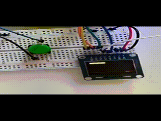

# Notes

- This project was made to experiment with watchdog and set it up so that you need to feed him via pressing an external button. To relay the reset/feeding information, an OLED display toggles its pixel in a loop animation in the main loop of the program. Watchdog is configured to reset the device unless its fed every ~ 2 seconds. See the GIF for visual demo.

- Main thing to look at here is the watchdog init in `IWDG_Init` and maybe feeding in interrupt handler for the button (`EXTI0_IRQHandler`). Conceptually, watchdog is really simple -- it is just a counter which force-resets the device if it counts to the target. It is used to detect situation when MCU gets locked / stalls somewhere, so it fails to perform the normal loop of the program. From what I understand, there are 2 strictness levels -- you either must feed the dog at least once in **x** amount of time, or you must feed it at least once in **x**, but no more than once in **y** amount of time. For instance, you must feed it every 2 seconds, but precisely between 1.5s and 2s time window. This is to make sure program is deterministic, even when it comes to execution speed.

> Rest of the code making the button, SysTick, and OLED display work is band-aid horrid abomination glued from `007` (button),`008` (OLED), and `201` (SysTick). I mean, it does work, but is really messy in terms of code management, because I was glueing projects together.

- Regarding `IWDG_Init` function - I had quite an issue of the watchdog not working when I initialized it (via `IWDG->KR = 0xCCCC;`) after tweaking the rest of the things in the function. From discussion with Gemini, this is due to the fact that enabling the dog allows for sync between the MCU and watchdog, because IWDG stands for **I**ndependent **W**atch**d**o**g**. This means it is external and runs on its own timer (32kHz I believe), and this needs to sync up with system clock, so if you dont enable it first, you cannot set those things. There is also just plain WDG, which is internal to the MCU in the sense that it shares the same HW clock

---

## Demo

