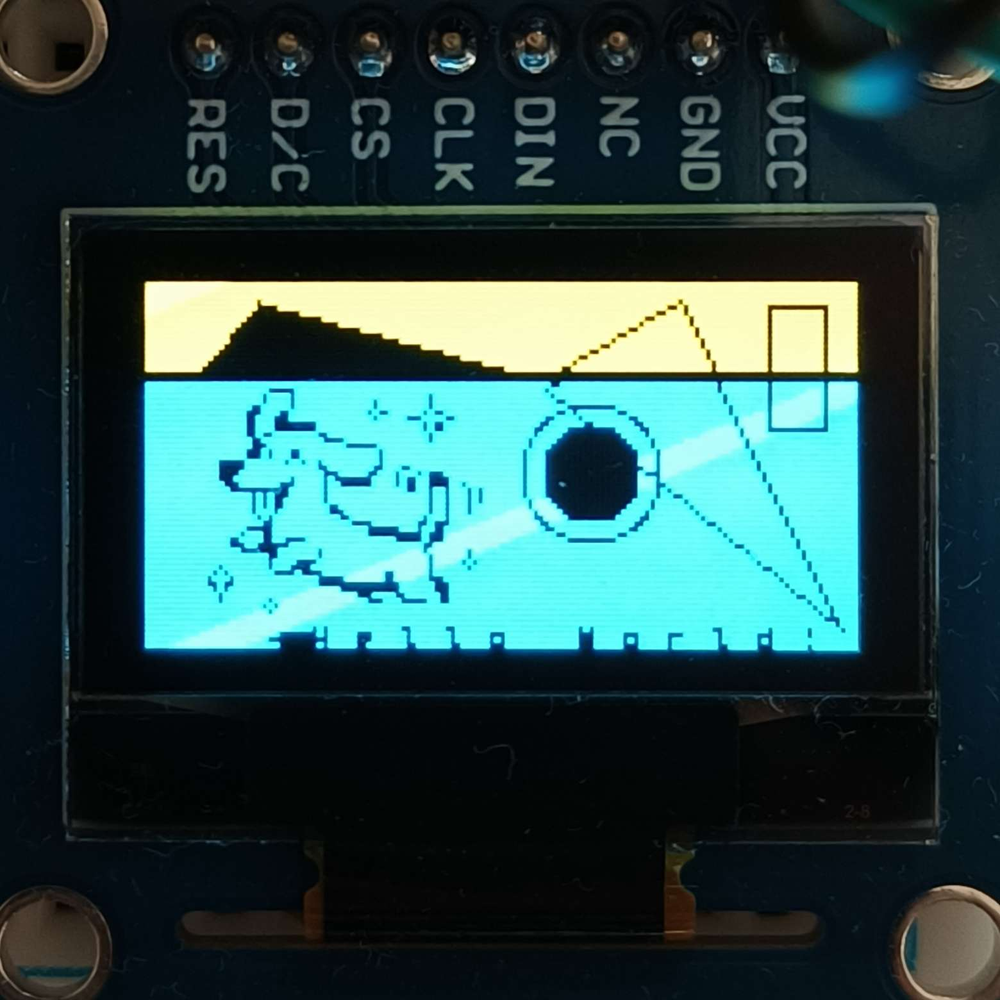

# Notes

> WIP

- This project was made so that future projects can easily utilize oled display. To make this easier, I decided to create basic driver to abstract initialization and stuff away and allow for some basic drawing and text writing. This will work as is if you wire the display up for 4-wire SPI exactly as described in `008_spi_oled` project, as the initialization assumes those pins to be used.

- Currently, this can:

1. draw/fill lines, rectangles, triangles, and lines
2. draw bitmap
3. draw letters/text, albeit mono space (kinda ugly and wastes space)
4. draw loadbars

> Should've made this prior to making `202_breadboard_tamagotchi` project, where text is just part of the UI banner

- Code can be found in `Source` and `Include` + `/device_drivers/display_driver/`

---

