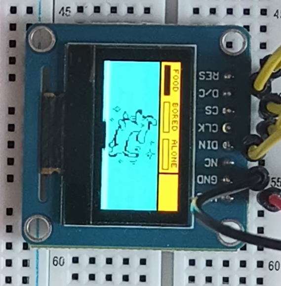
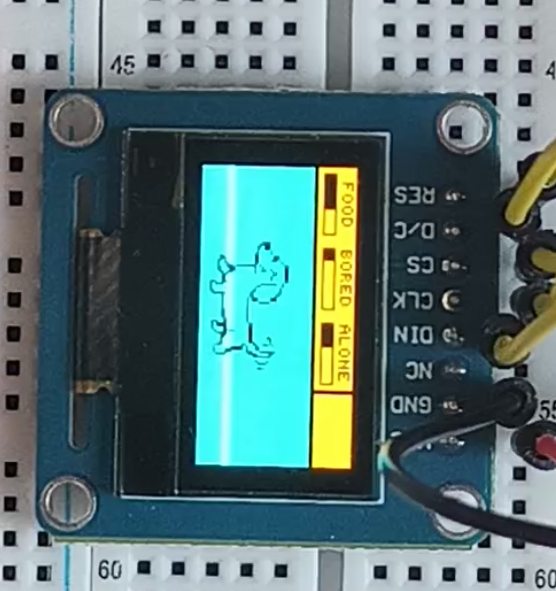
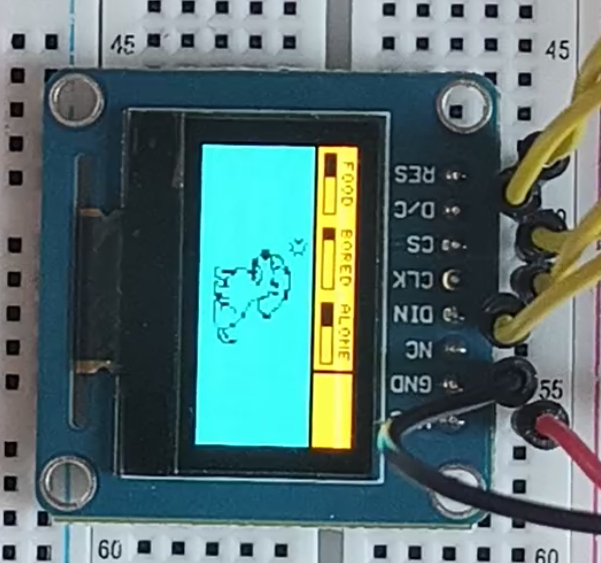
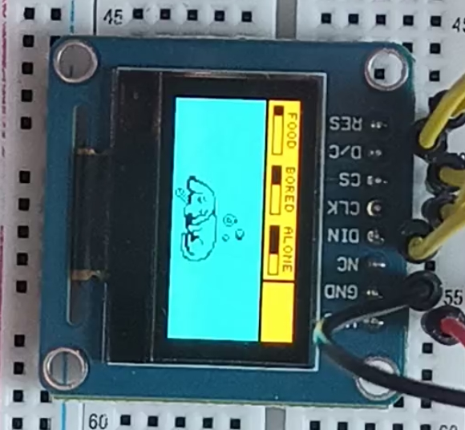
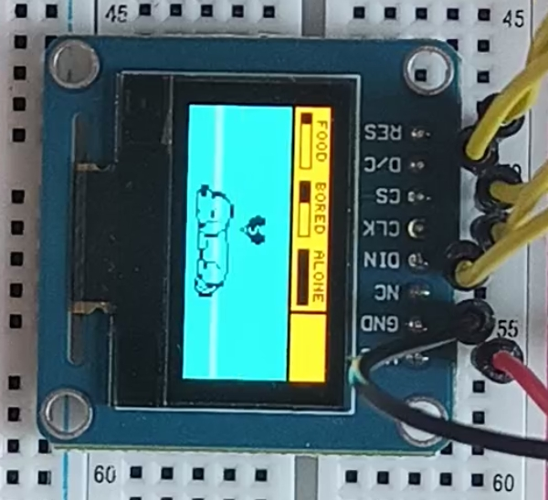
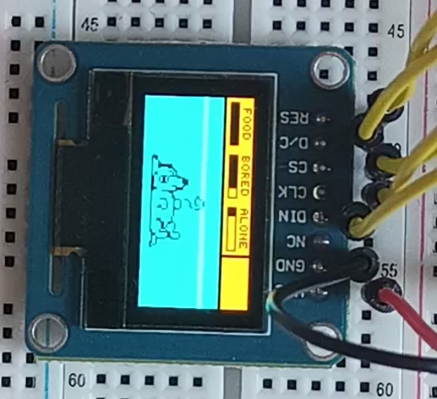

# Breadboard tamagotchi

This program mimics old-school tamagotchi pet console (at least I think so, I never really owned one). It uses 0.96 OLED 128x64 display with yellow top bar (128x16) and blue bottom part (128x48), and 3 buttons. Program renders UI with status bars for `FOOD`, `BORED`, and `ALONE` on the yellow part of the display, and current pet emotion based on that in 72x48 viewport centered in the blue part of the display. State machine decides, which emotion to show based on current stats. Buttons serve to *treat* the pet in a certain way (give it food, pet it, play with it) to improve its overall emotion. For detailed overview, see the sections below.

## DEMO

### [Video `demo_tilemapse.mp4`](./local_source/assets/demos/demo_timelapse.mp4)

### Pictures

> Forgot to record *Pining* emotion, because it was unreachable due to bug during timelapse recording :).

* 

* 

* 

* 

* 

* 

## Overview & Architecture

I **tried** to make the whole system somewhat modular, though currently it is far from that. I still have plenty of TODOs and ideas for things to add to learn.

### `Pet` struct

The whole program logic is `Pet`-centric, as there is only ever one and it's current status is what dictates what to do next. `Pet` struct has its `.c` and `.h` files in `./local_source/pet/` directory. It is basically just a fat struct holding (meta)data, most importnatly current values for the 3 pet stats (`food`,`bored`,`alone`), its current emotion (`currentEmotion`), and pointer to its array of bitmaps (`emotion_array`). Some metadata are unused as of now (`currentActivity`).

Possible emotions are in an enum `PetEmotion` and you use them to select emotions from `emotion_array`. This is important, as it allows for somewhat easy way to add custom new Pets, **AS LONG AS YOU MAKE SURE THEIR EMOTION ARRAY MATCHES THE ENUM ORDER**. I added dog Miky as a pet, and his definition can be seen in `./local_source/assets/miky.h`. There you can see all the various bitmaps and at the very end, the emotion array:

```C
const uint8_t* const miky_emotions[] = {
    excited,
    happy,
    heartbroken,
    hungry,
    lonely,
    sick,
    angry,
    bored,
    pining,
    rip,
    sad
};
```

Having to make sure enum order matches array order might be a pain, but I feel like this is good, as one can easily swap in or create new pet with different art.

> **Note on creating the bitmaps**: I had Gemini create some monochrome pixel arts and instructed him to maintain 3:2 aspect ratio (to make downscale to 72x48 easier). I then converted these to C-style arrays with [this awesome tool](https://notisrac.github.io/FileToCArray/)

#### `Pet` related functions

There are functions to handle each stat update (based on GPIO state of the buttons servicing them), but **most important functions out of the whole program by far** are `Pet_UpdateState` and `Pet_Transition`. First one handles natural decay of stats if the pet is left untreated (based on `last_time_*` variables holding last interaction for that stat). Second function is de-facto transition function of the state machine, that is our pet (hence the name `Pet_Transition`). 

To make the pet somewhat expressive and reactive to the stats, a score system is in place. Each stat has *severity* value between `0` and `3` determined based on how far away they are from the *ideal* state (that being `PET_MIN_STAT_VALUE` for `alone` and `bored`, and `PET_MAX_STAT_VALUE` for `food`). Higher severity means being farther from ideal state. With these severity values, we then assign emotions to reflect the situation. 

>For instance, if sum of the severity values is `>= 7` (every stat is at least at severity `2` and one is at `3`), then the pet will be heartbroken. When the sum is between `3` and `5`, we check if any one given stat is really bad (at severity `3`) and that one takes priority for the emotion expression. If no stat is really bad in this situation, we make the pet expression simply angry, as it is mad you are not treating it.

This system is by no means perfect, but if feels granular enough without state explosion, so that's fine with me.

### SysTick

For measuring time windows, Basic SysTick with 1ms repeating interrupt, incrementing tick counter is implemented. It is used to determine if pet was left alone for long enough for a stat to decay. Implementation can be found in `./local_source/tick_engine/`. It is copy-pasted from `201_bad_apple`.

### Interfacing with the display

In order to draw the bitmaps of pet emotions and the stat UI bar, I made a `./local_source/display_driver/` directory with 2 main layers to abstract interfacing with the HW -- `oled_hw` and `ddriver`.

#### `oled_hw`

This layer is the most low-level one. It encompasses initialization of pins, SPI and DMA for data transfer to the display, as well as display initialization. DMA is used so that frame-to-be-rendered can be sent over SPI byte-by-byte without hogging and blocking the CPU. For more details on how commands vs data is being sent etc, see `008_spi_oled`. This layer is exclusively used internally by the `ddriver`, which is meant to be *user-facing*.

#### `ddriver`

This is the abstraction layer made to make working with the display cleaner. It's basically a wrapper around the SPI communication implemented in `oled_hw`, which extends this with 2 buffers for double-buffered rendering. It has 3 main functions (which is all that's needed for this at this point):

1. `dd_draw_bitmap` -- main function used to render both the statick backdrop of the top UI, as well as current pet emotion art. You can specify `x` and `y` (top-left corner of the bitmap) location, `width` and `height`, and also whether to interpert each byte from least significant or most significant bit (as 1 byte holds 8 pixels, because this is monochrome). This matters and might be display (or current display config) specific, so I included it. Function assumes display is in column mode (because I knew I will have it set up that way, as I did in `201_bad_apple`), and bitmap is in standard horizontal mode. Once called, it draws the bitmap into current frame buffer (the one to be pushed next).

2. `dd_fill_rect` -- this function allows to fill in rectangle (either with enabled or disabled pixels) of the current frame. It is used to fill in the status bars of the UI.

3. `dd_update` -- Publisher function, that commits the current frame to the DMA to send it off via SPI. If this is called while an ongoing DMA transfer is happening (ie. previous frame is not send fully yet), it blocks. Without blocking, this would swap the frames so the one mid-transfer would become the current one, allowing for rewriting it while it is being read by the DMA.

### Input

Input is handled via polling for the GPIO state of the button pins. Code can be found in `./local_source/input_driver`. We keep history byte for each button, shifting in new latest bit every time we call `Input_Update` and it has been `>= 10` miliseconds since last check. If the history byte for a given button is `0xFF`, then we toggle a flag to confirm it was pressed. These flags are then checked in the main program loop and toggled off, and we update dog stats to reflect the button press.

### Main program flow

The game loop itself is rather simple. First we init all the peripherals and create our pet Miky, then we enter infinite loop where if Miky is still alive (via `alive` bool flag check), we:

1. Poll for input updates with `Input_Update`. This will update the button flags we check later to latest state.

2. Handle input flags and call corresponding `Pet_*` methods (for eating, petting, playing with) to update `Pet` struct stats.

3. Call `Pet_UpdateStats` function to run the stat decay logic, if pet was left untouched for long enough.

4. Call `Pet_Transition` function to take the latest stat values and evaluate, what the pet should currently be feeling.

5. Call `dd_draw_bitmap`, where we draw the `emotion_array[currentEmotion]` bitmap for the pet. This will draw in the emotion selected by `Pet_Transition` function called in the previous step.

6. Call `dd_update` to actually render the frame.


### Wiring

#### Display

- I wired everything using the Arduino pins (Females) with the OLED display in 4-wire SPI mode (default) like so:

| STM32 board pin label | OLED display pin label |
| ----------- | ------------ |
| 3V3 (Power) | VCC |
| MOSI/D11    | DIN |
| SCK/D13     | CLK |
| PWM/CS/D10  | CS  |
| D8          | D/C |
| PWM/D9      | RES |

> And of course, both board and display GND to the same board minus column

#### Buttons

I cross-wired the buttons, with food button wired to arduino pin A2, bored button to A3, and pet button to A1.

---

## TODOs, Improvements, Tweaks, and stuff

TODO Write out plans