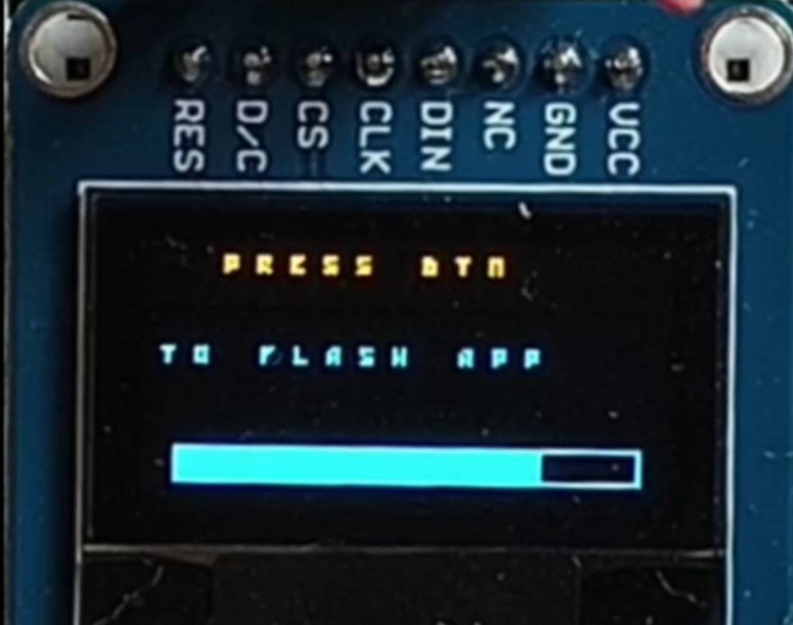
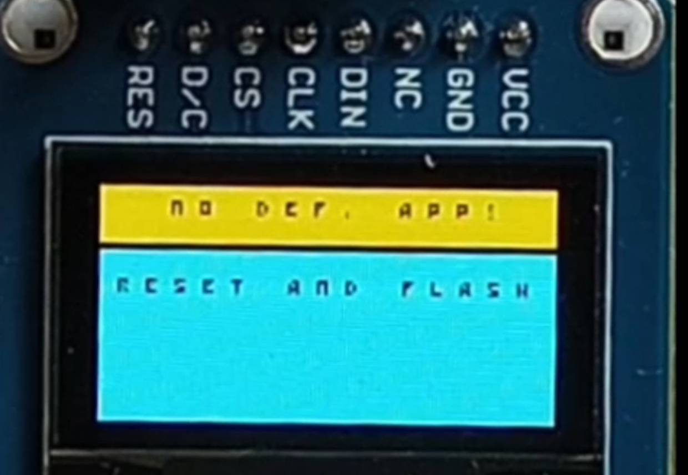
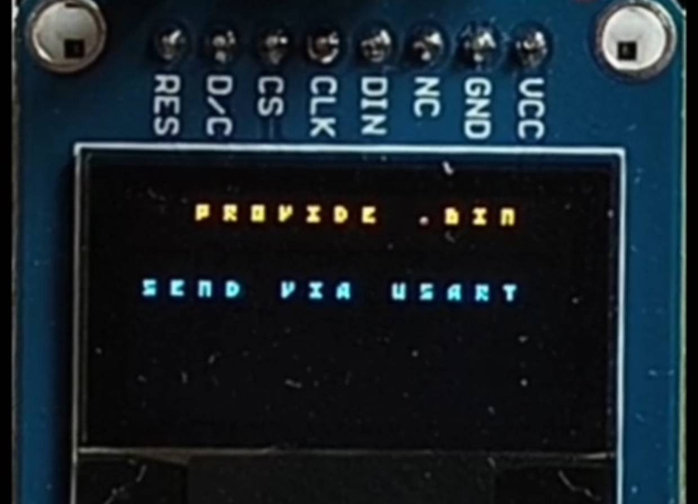
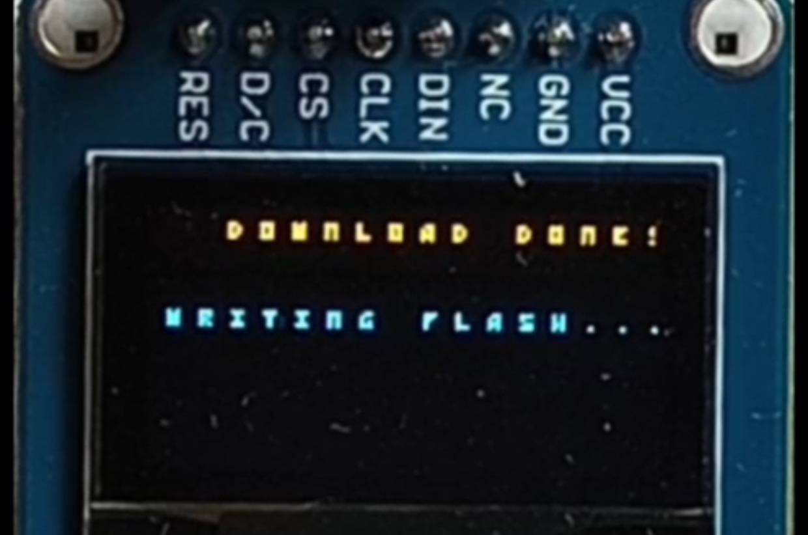
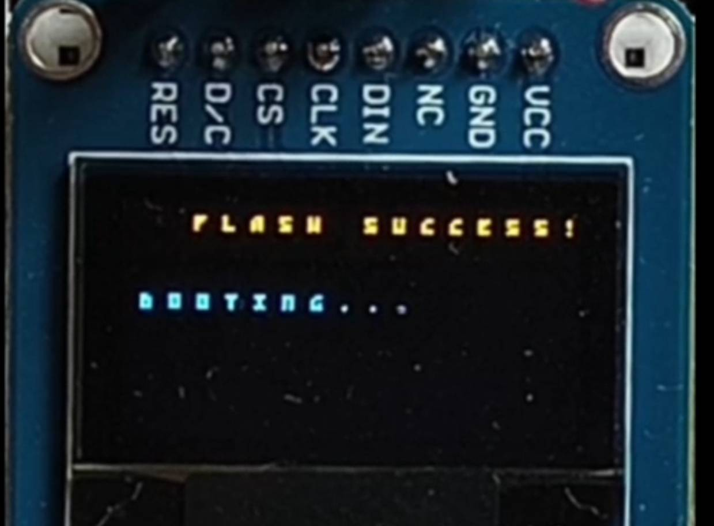
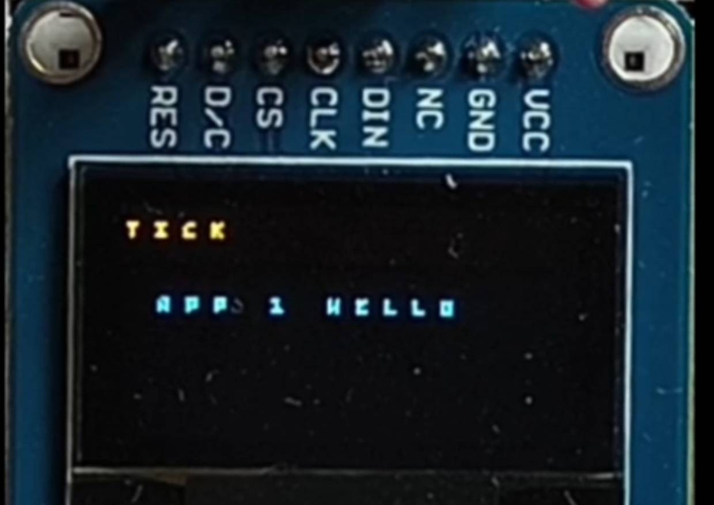
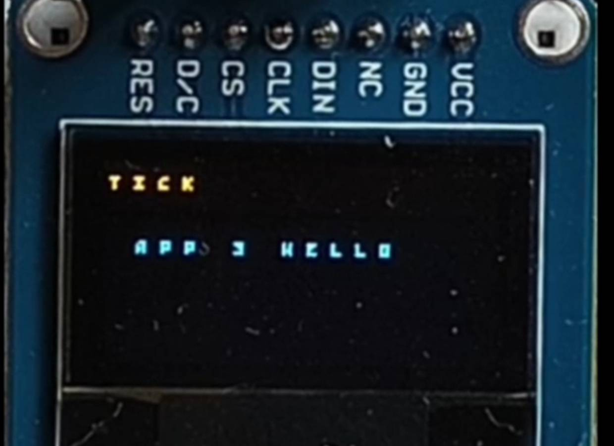

# Single-Bank Bootloader

This program serves to employ a basic in-app programming single-bank bootloader. It uses oled display (over SPI) to render UI to the user and expects a USER button press within a grace period after power-on. If button was pressed, user can flash `.bin` (at most `32kb`) of an app over USART2. Bootloader then writes this app to flash, and passes control to the app, *booting* into it. If the grace period was ignored and no app is to be found (from flash done previously), then it enters a `while(1)` loop, informing the user to reset and flash app.

I chose this because I got curious about how updates to low level/smart home stuff are done remotely. While a major simplification, this project conceptually follows very similar process over-the-air updates (although here, it is over-the-wire). It also acts similar to what the MCU actually does on power on, as it has its own bootloader of course. In production, this would of course be much more involved, mainly it would most certainly be Double-Bank Bootloader (A/B partitions to always have fallback version), and after getting the binary for the app, actual checksum and confirmation process would occur to make sure we are booting something unaltered.

## DEMO

### [Bootloader demos in one `.mp4`](./assets/bootloader_demos.mp4)

### Pictures

- 

- 

- 

- 

- 

- 

- 

---

## Overview & Architecture

TODO write out

---

## TODOs

- Add some form of checksum to confirm binary was send well over the wire
- Add non-volatile flag to denote the flash memory is populated with app from previous flash (now it works as long as we dont overrite memory at that 32k offset reserved for Bootloader itslef, but it is very much risky to just jump there as long as stack pointer seems to point to sensible location)