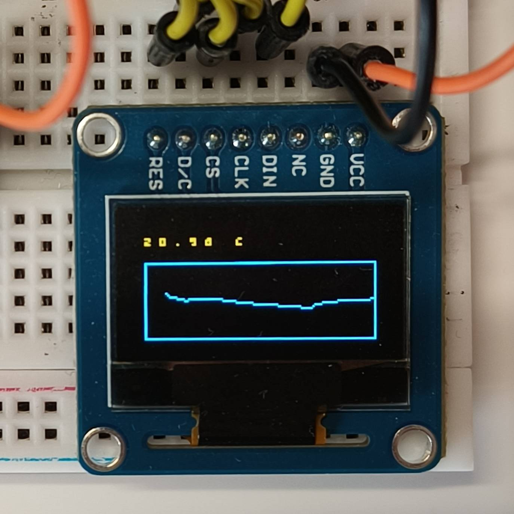
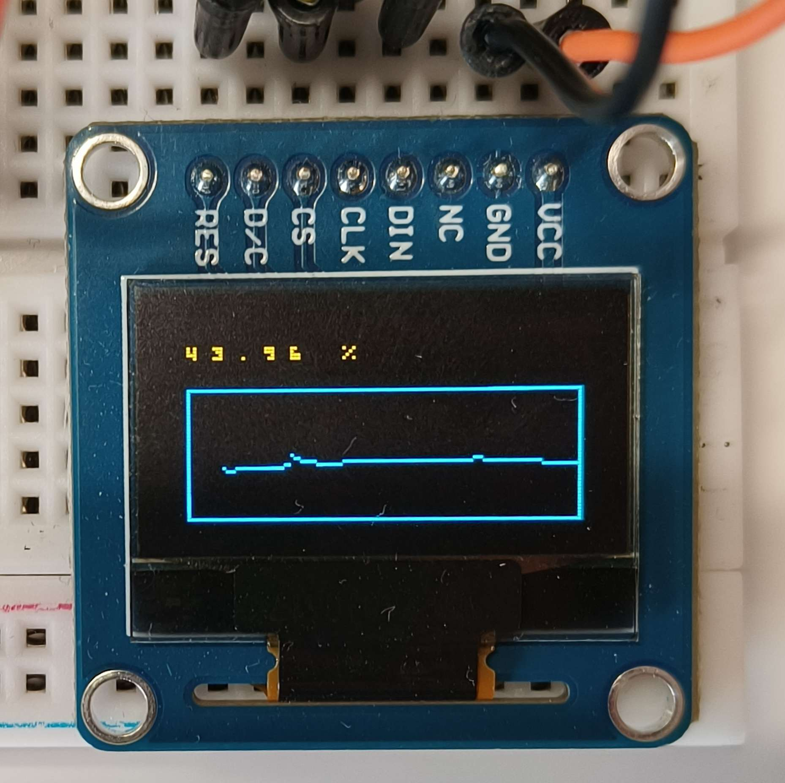
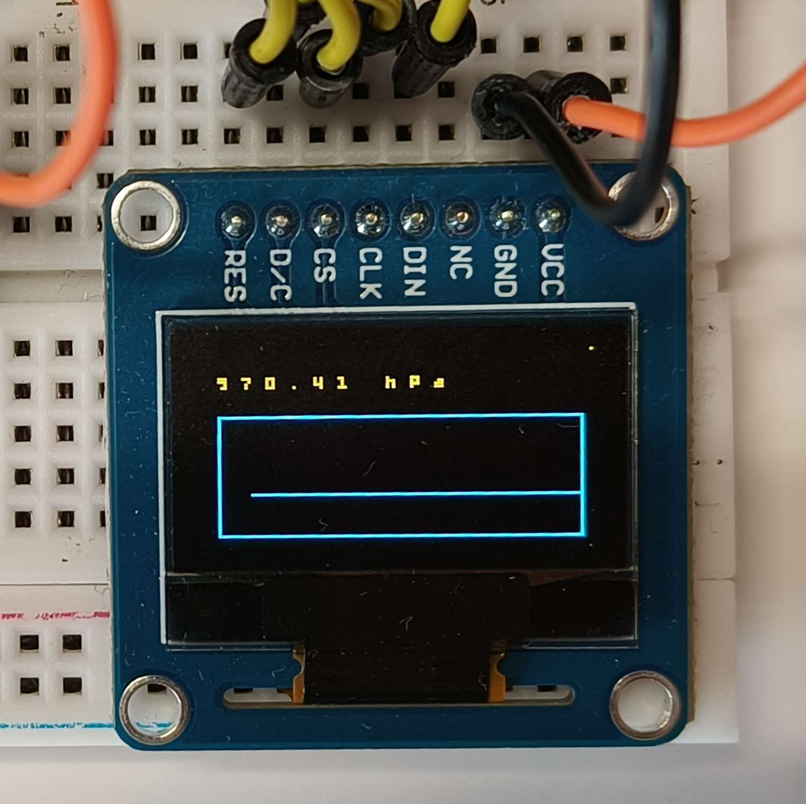

# FreeRTOS BME280 Temperature/Humidity/Pressure sensor logger with chart plotting

---

## DEMO

## TODOs

* Rewrite `sensor_hw` layer to not spin-lock when waiting for transfer back
* Add Input polling to change `active_metric` and reset spotlight counter when pressed.