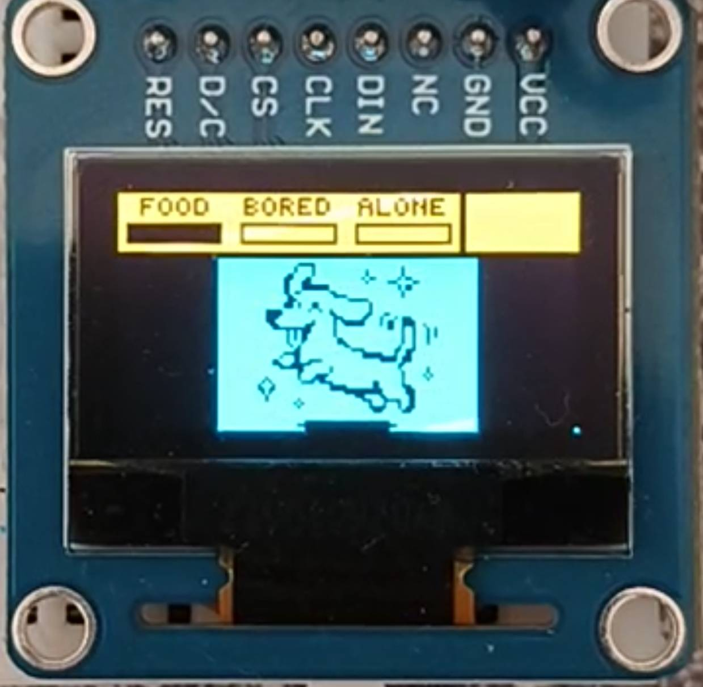
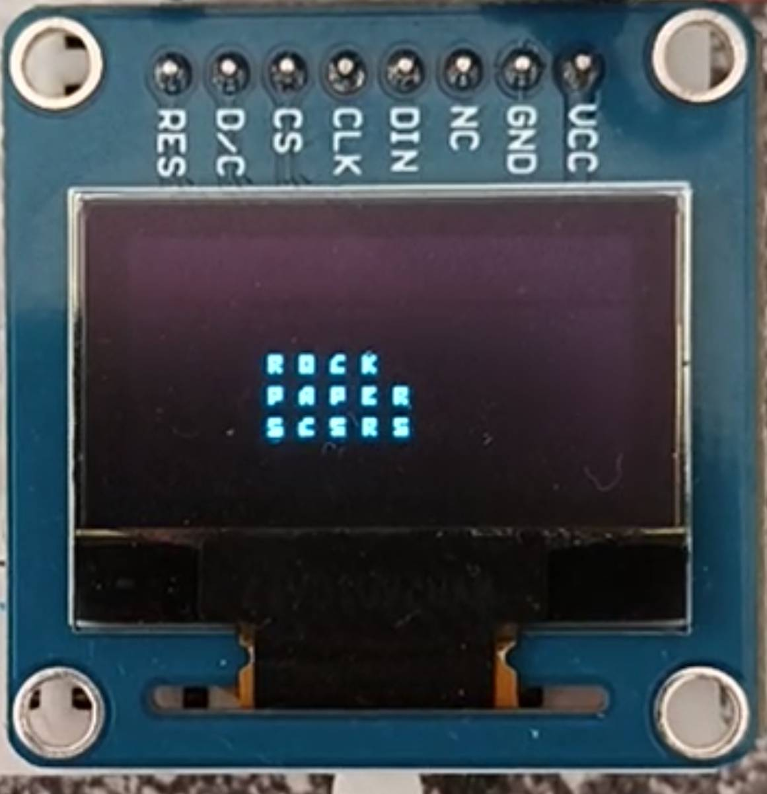
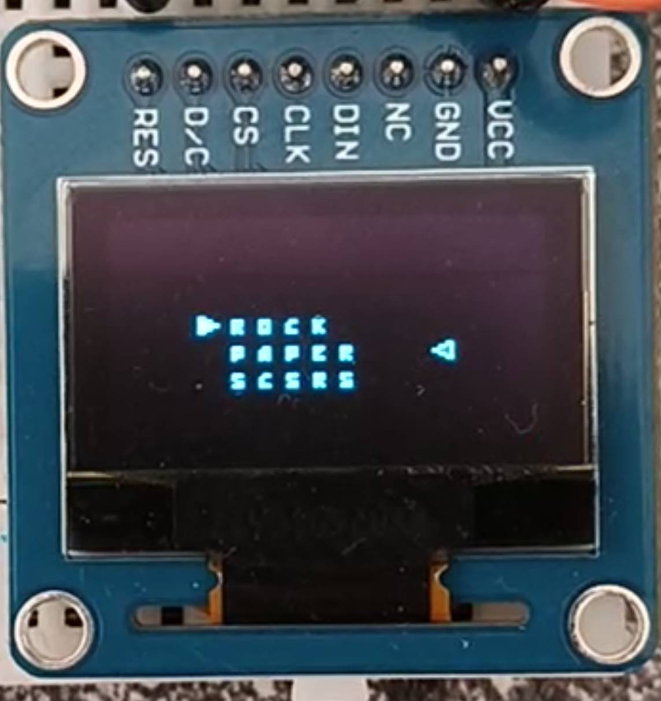
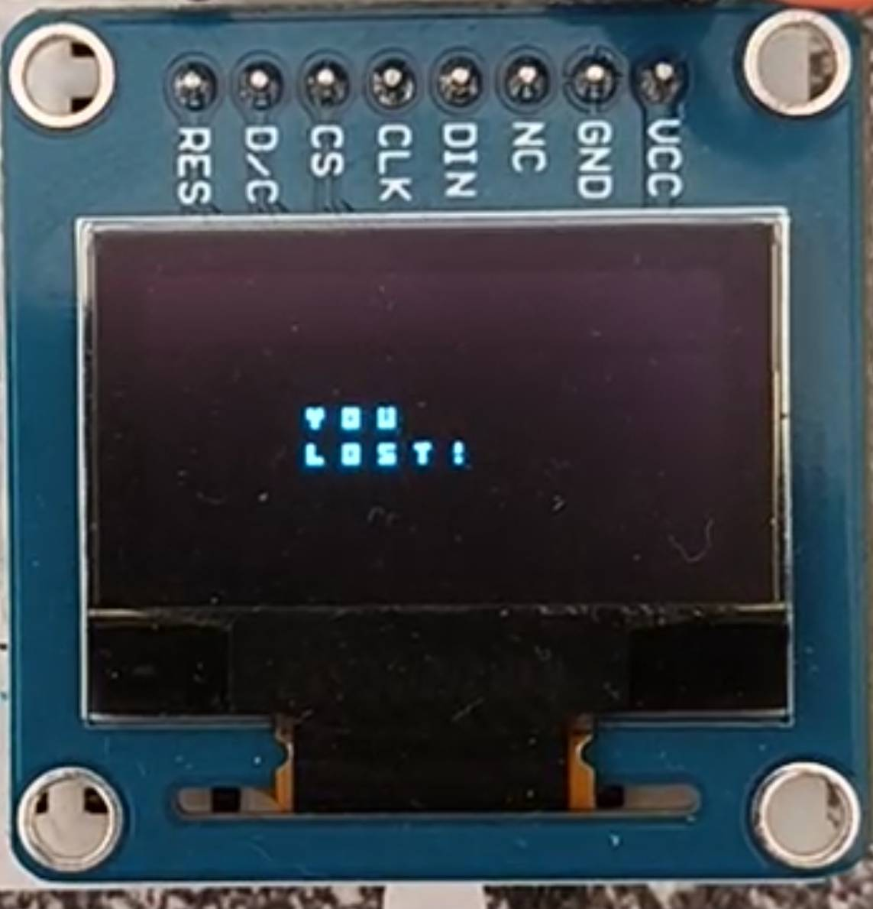

# Tamagotchi using FreeRTOS, with mini game runner for one of the buttons

This project is adaptation and extension of `202`. It uses FreeRTOS task to run the same tamagotchi-esque game as `202`, BUT it extends it with a mini game runner, which runs a minigame every time you choose to lower boredom of your pet.

## DEMO

* 
* 
* 
* 


## Overview & Architecture

This was rather complicated to do in a way which allows extension to add any number of games -- specifically, there was need to add input abstraction in order to be able to swap out button assigned functions on the go AND mini-game itself is abstracted and operated via `MiniGameRunner` struct. It can hold multiple mini games, provided they match specific API and provide:

* Init function `void initFn(void)`
* Render function `void renderFn(void)`
* Update function `void updateFn(bool*)`. This takes bool so that `MiniGameRunner` can pass in a boolean flag from game instance to find out when it should end the game -- you would set this to true the moment you are supposed to back out into the normal tamagotchi loop. This is rather bad and convoluted :).
* Input mapping struct for the minigame `im`, which defines inputs and assigned actions (functions). In order to make this generic, function signature is casted to generic `void(*)(void)`. Should it require different signature for handling button press (such as passing object in), a wrapper must be used -- reason for this is because I am a moron and this is not ideal, but such is life.

`MiniGameRunner` holds these games in array of structs of `GameInstance_t`, which look like this:
```C
typedef struct {
    fn initFn;
    ufn updateFn;
    fn renderFn;
    InputMapping im;
    bool exit_flag;
} GameInstance_t;
```
In `main.c`, an initialization of game runner with Rock-Paper-Scissors game can be seen:
```C
MiniGameRunner_t MiniGameRunner = {
    .running = false,
    .currentMinigame = MINI_GAME_COUNT,
    .games = {
        // Rock-Paper-Scissors
        {.initFn = rps_initFn,
         .renderFn = rps_renderFn,
         .updateFn = rps_updateFn,
         .im =
             {.inputs =
                  {INPUT_BTN1,
                   INPUT_BTN2,
                   INPUT_BTN3},
              .actions =
                  {rps_select_paper,
                   rps_select_rock,
                   rps_select_scissors}},
         .exit_flag = false
        }
    }
};
```

### RTOS Stuff

This program works with 3 tasks -- `vRenderTask`, `vGameUpdateTask`, and `vInputHandlerTask`. Names are rather self-explanatory. This is essentially an extension of `202`, adapting FreeRTOS. For input, a queue is used to buffer them (polling every 10ms, configurable) using `vInputHandlerTask` and exhaust / execute them in `vGameUpdateTask`. 

I tried to make it really separate and do just what is in their job description, so `vRenderTask` for instance only renders onto the screen. What exactly to render is dictated conditionally by Pet's current activity. if `Miky.currentActivity == ACTIVITY_IDLE`, then we render the basic top UI stat bar and current emotion. If we went in-game, `currentActivity` will be `ACTIVITY_IN_GAME`. To not force extending this switch statement to now render different things based on which exact game we are in (were to have multiple games, not just one), it is abstracted away and one of the reasons for the whole game runner abstraction. With that in place, `vRenderTask` only has to check if game runner is running, and if so - call the render function of currently running game:

```c
//...
case ACTIVITY_IN_GAME:
    if (mgr_is_running(&MiniGameRunner))
    {
        mgr_call_renderFn(&MiniGameRunner);
    }
    break;
//...
```

`vGameUpdateTask` functions very much analogous to this, once again looking at `currentActivity`. In addition to that though, it also handles exhausting the input queue, which is being filled by `vInputHandlerTask` sampling for button inputs. This once again has to be made such that based on `currentActivity` we call corresponding function which the button input should trigger in that state -- if we were in-game, our buttons are for selecting Rock/Paper/Scissors, not for changing Pet Food/Bored/Alone stats. This is the reason for each game instance having `InputMapping` struct, where we map buttons to functions (by index, very naive but works):

```C
//...
typedef void (*actionFn)(void);

typedef enum
{
    INPUT_BTN1 = 0,
    INPUT_BTN2,
    INPUT_BTN3,
    INPUTS_COUNT
} GameInput;

typedef struct
{
    GameInput inputs[INPUTS_COUNT];
    actionFn actions[INPUTS_COUNT];

} InputMapping;
//...
```

This then allows `vGameUpdateTask` to just fetch current runnning minigame input mapping, and run corresponding function:

```C
//...
case ACTIVITY_IN_GAME:
    mgr_get_current_game_instance(&MiniGameRunner)->im.actions[currentInput]();
    break;
//...
```

> Do note that the moment you cant do with just a `void ()(void)` function, you need to either create wrapper to use here, or explicitly ask for which game runs, and cast that call, defeating the purpose of this -- reason for this being so bad and restricted is I made it :) 

Lastly, `vInputHandlerTask` polls GPIO pins and fills it into a history variable for each (a byte - meaning last 8 polls). Once it detects a falling edge (`0b1000 0000` ~ it was pressed, the bounces happened, now it is being held for the last 7 polls), it pushes event into the queue.


### Mini Game Stuff

The minigame itself is implemented in `./local_source/mini_game/rps`. It is basically just a state machine with HW RNG support for the MCU choices. 

> The details of the game are not as important for the main idea behind the program -- that being FreeRTOS tamagotchi with abstracted runner for games, where they also need to interface with input and display, without it becoming a state explosion of `switch` clauses (it almost did anyway).